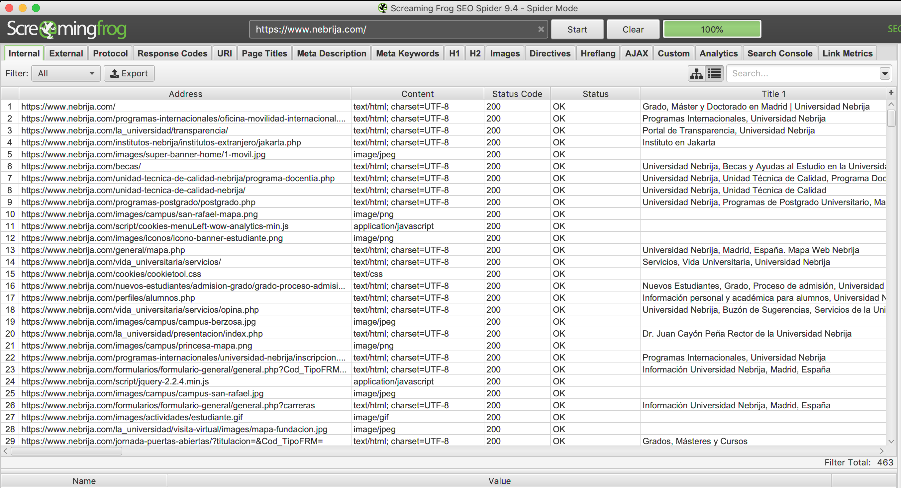
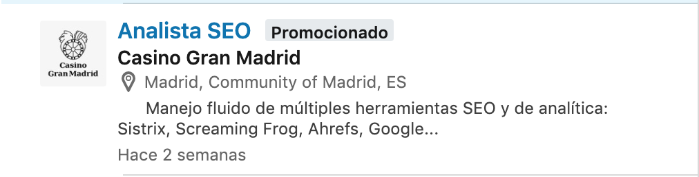
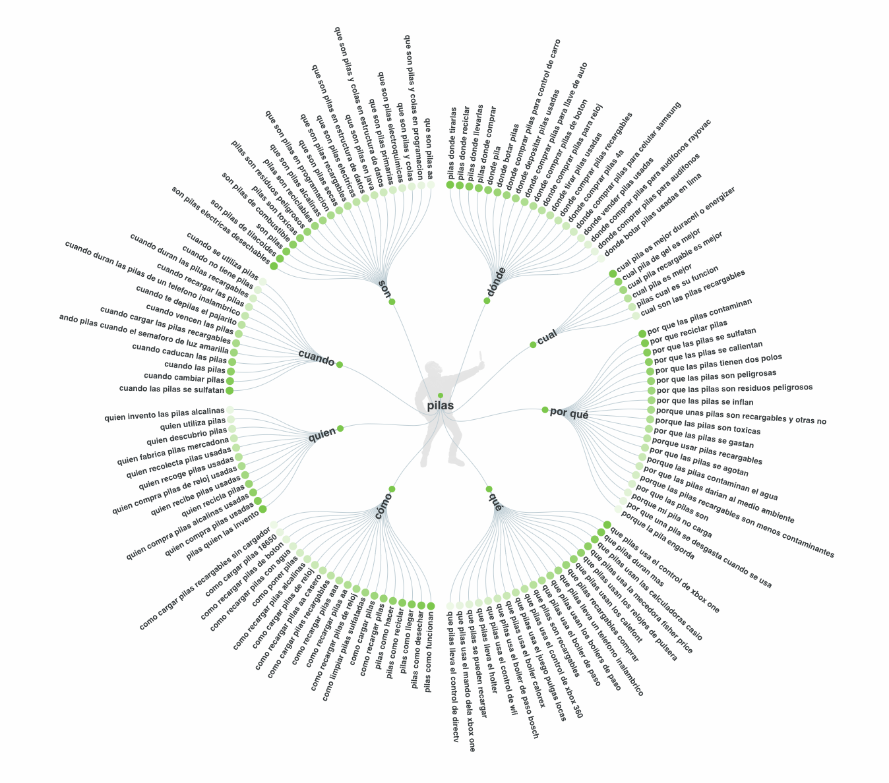

# 10 Computer problems and solutions

## 1. SEO audit (SEO)

* Tool: [Screaming Frog](https://www.screamingfrog.co.uk/)

  

* LinkedIn Job Search: 35 results (Spain)

  


## 2. Keyword research (SEO)

 * Tool: [Answer the public](https://answerthepublic.com/)

   


## 3. Create a Chrome extension (Developer)

  1. Create manifest.json

  2. Create file that we call from manifest.json

  3. Generate cert

     ```
     openssl genpkey -out rsakey.pem -algorithm RSA -pkeyopt rsa_keygen_bits:2048
     ```

  4. Update extension [Chrome extensions](chrome://extensions) (Developer mode)

  Extra: [Screaming Frog](https://developer.chrome.com/extensions/getstarted)


## 4. Create tests with Katalon (Testing)

* Tool: [Katalon Recorder](https://chrome.google.com/webstore/detail/katalon-recorder/ljdobmomdgdljniojadhoplhkpialdid)

* Commands: open, verifyText, click, verifyTextPresent

* LinkedIn Job Search: 468 results (Spain)


## 5. BigML (Machine Learning)

* Tool: [BigML](https://bigml.com/)

* Load dataset from https://bigml.com/dashboard/sources

* LinkedIn Job Search: 807 results (Spain)


## 6. Web Analytics (Design)

* Resource: [Renfe review](https://perf.reviews/reviews/1.5-renfe.com/)

* Tools:
  * [web.dev](https://web.dev/)
  * [Woorank](https://www.woorank.com/es)
  * [Page Speed Insights](https://developers.google.com/speed/pagespeed/insights/?hl=es)


## 7. Web Scrapping (Developer)

* Tool: [Repl.it Ruby](https://repl.it/languages/ruby)

* LinkedIn Job Search: 9 results (Spain)


## 8. Python (Machine Learning)

* Tool: [Google Collaboratory](https://colab.research.google.com/)


## 9. Simple Pentest (Security)

* Resources:
  * [Install Pentesting Tool (Mac)](https://garthhumphreys.com/2018/03/02/setup-your-mac-for-pentesting/)
  * [k0sasp](http://k0sasp.kontrol0.com/home/descargas) OWASP


## 10. Info from my bank (Developer)
